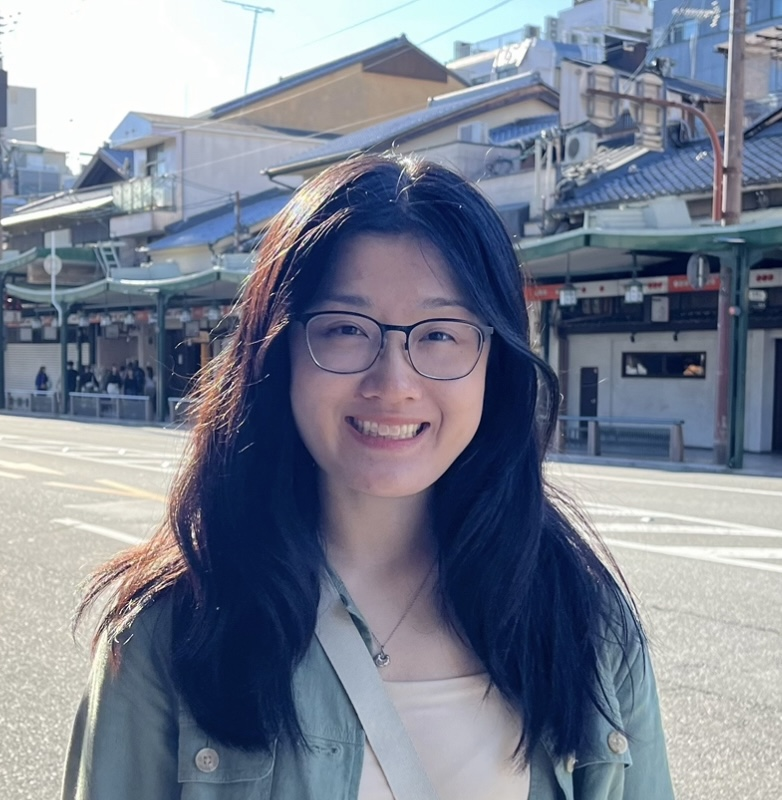

::: {.profile-container}
{.profile-img}
**Xiaohan Liu**

[CV](docs/Margot_CV.pdf) · [ORCID](https://orcid.org/0000-0000-0000-0000)
:::

I am a second-year Biostatistics PhD student at the University of Pennsylvania broadly interested in causal inference. Some words that catch my attention are *efficiency*, *assumption-lean*, and  *personalized/precision medicine*. I am foruntate to be advised by --- and ---

Before joining the PhD program, I obtained my BS in Statistics and Data Science from Carnegie Mellon University.

For chats about research ideas, potential collaborations, music, or <a href=https://www.goodreads.com/user/show/159086831-xiaohan>books</a>, feel free to reach out at liuxh[at]upenn[dot]edu!

 

### Education

- **PhD in Biostatistics**  
  The University of Pennsylvania, expected 2029
- **BS in Statistics and Data Science (Mathematical Sciences Track)**  
  Carnegie Mellon University, May 2024

<footer style="text-align: center; padding: 10px; font-size: 12px; position: relative; bottom: 50; width: 100%;">
  
I took inspiration for this website from others.

</footer>

